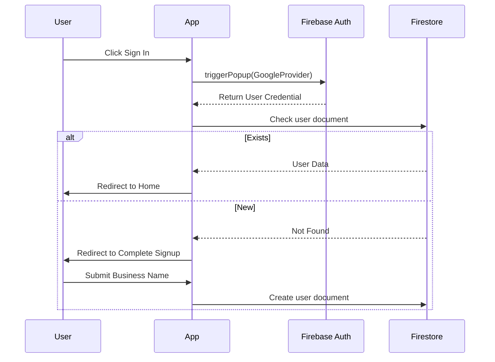

# System Architecture

Siyayya is built on a modern, serverless stack prioritizing performance, scalability, and developer velocity.

## High-Level Architecture

The platform operates using a Jamstack-inspired model:
- **Frontend**: A React SPA built with Vite, deployed to Vercel edge networks.
- **Backend (BaaS)**: Firebase handles authentication, real-time database (Firestore), and media storage.
- **Serverless API**: Custom Vercel serverless functions handle sensitive operations like payment webhooks and Cloudinary signatures.

```mermaid
graph TD
    Client[Client (Browser/PWA)] --> |Static Assets| Vercel[Vercel Edge Network]
    Client <--> |Real-time Data| Firestore[(Firebase Firestore)]
    Client <--> |Auth Tokens| FirebaseAuth[Firebase Auth]
    Client <--> |Media Upload/Download| Storage[(Firebase Storage/Cloudinary)]
    Client --> |API Requests| VercelFunctions[Vercel Serverless Functions]
    VercelFunctions --> |Webhooks/Admin Actions| Firestore
    VercelFunctions <--> |Payment Processing| Paystack[Paystack API]
```

## Frontend Architecture (React)

Siyayya utilizes a feature-based folder structure to maintain cohesion and prevent "folder-by-type" clutter.

### Core Patterns
- **Routing**: `react-router-dom` using declarative `<Route>` definitions in `App.tsx`.
- **State Management**: 
  - Server state: `react-query` for caching, deduping, and background updates.
  - Global UI state: `zustand` (e.g., discovery feed settings).
  - Component state: Standard React hooks (`useState`, `useReducer`).
- **Styling**: Tailwind CSS combined with `shadcn/ui` components for rapid, consistent, and accessible UI development.

### Authentication Flow

Siyayya enforces a strict Google-only authentication strategy.

1. User clicks "Sign In with Google".
2. Firebase Auth handles the OAuth handshake.
3. Upon success, Firebase returns a User credential.
4. The frontend checks if the user exists in the `users` Firestore collection.
5. **New User**: Redirected to `/complete-signup` to provide a mandatory Business Name and Campus selection.
6. **Returning User**: Grants access to protected routes.



## Payment Flow (Paystack)

Payments for premium features (like bumping a listing) are handled via Paystack.

1. Client initializes transaction using Paystack React wrapper.
2. User completes payment via Paystack modal.
3. Paystack fires a webhook to our Vercel Serverless function (`api/payments/webhook.ts`).
4. Serverless function verifies the webhook signature using the Paystack Secret Key.
5. If valid, the function updates the Firestore document (e.g., marks an order as `paid`, updates listing status).

## Chat Architecture

Messaging is built natively on Firestore to leverage its real-time synchronization.

- **Structure**: Conversations are top-level documents, containing an array of participant IDs. Messages are stored in a `messages` subcollection within each conversation.
- **Real-time**: `chatService.ts` sets up an `onSnapshot` listener to sync new messages instantly without polling.
- **Security**: Firestore rules ensure a user can only read/write to conversations where their UID is in the `participantIds` array.
